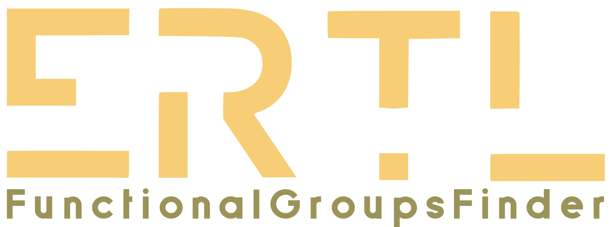

# ErtlFunctionalGroupsFinder
An open implementation of the [Ertl algorithm for functional group identification in organic molecules](https://doi.org/10.1186/s13321-017-0225-z).

 

See the GitHub repository here: [https://github.com/JonasSchaub/ErtlFunctionalGroupsFinder](https://github.com/JonasSchaub/ErtlFunctionalGroupsFinder)

## Description
The algorithm for automated functional groups detection and extraction of organic molecules developed by Dr Peter Ertl
is implemented on the basis of the [Chemistry Development Kit (CDK)](https://github.com/cdk/cdk).  
This open reimplementation named ErtlFunctionalGroupsFinder is described in a [scientific article](https://doi.org/10.1186/s13321-019-0361-8).  
 ErtlFunctionalGroupsFinder is also available in the open Java rich client application MORTAR ('MOlecule fRagmenTation fRamework')
where <i>in silico</i> molecule fragmentation can be easily conducted on a given data set and the results visualised
([MORTAR GitHub repository](https://github.com/FelixBaensch/MORTAR), [MORTAR article](https://doi.org/10.1186/s13321-022-00674-9)).

## Contents of this repository
### Sources
The <a href="https://github.com/JonasSchaub/ErtlFunctionalGroupsFinder/tree/main/src">"src"</a> subfolder contains
all source code packages including JUnit tests.

### Tests
The test class <i>ErtlFunctionalGroupsFinderTest</i> tests the functionalities of ErtlFunctionalGroupsFinder.
Among other things, it tests whether the correct functional groups are detected in example molecules.

### Test resources
The test <a href="https://github.com/JonasSchaub/ErtlFunctionalGroupsFinder/tree/main/src/test/resources">"resources"</a> subfolder
contains an SD file with a small subset of small molecules taken from the [Chemical Entities of Biological Interest (ChEBI) database](http://www.ebi.ac.uk/chebi)
for example usage purposes. The database is licensed under the [Creative Commons License (CC BY 4.0)](https://creativecommons.org/licenses/by/4.0/)
which allows distribution and modification.

### Performance Snapshot CMD Application
The folder <a href="https://github.com/JonasSchaub/ErtlFunctionalGroupsFinder/tree/main/Performance_Snapshot_App_jar">"Performance_Snapshot_App_jar"</a>
contains the executable JAVA archive <i>ErtlFunctionalGroupsFinder-PerformanceSnapshotApp.jar</i>.
It can be executed from the command-line (command: java -jar) to do a performance snapshot of the ErtlFunctionalGroupsFinder.find()
method under parallelization on multiple threads.
For more details see the file
<a href="https://github.com/JonasSchaub/ErtlFunctionalGroupsFinder/blob/main/Performance_Snapshot_App_jar/Performance%20usage%20instructions.txt">"Performance usage instructions.txt"</a>

## Example initialization and usage of ErtlFunctionalGroupsFinder
see in <a href="https://github.com/JonasSchaub/ErtlFunctionalGroupsFinder/wiki">"wiki"</a>

## Installation
ErtlFunctionalGroupsFinder is hosted as a package/artifact on the sonatype maven central repository. See the
<a href="https://central.sonatype.com/artifact/io.github.jonasschaub/ErtlFunctionalGroupsFinder/">artifact page</a> for installation
guidelines using build tools like maven or gradle.
 
To install ErtlFunctionalGroupsFinder via its JAR archive, you can get it from the
<a href="https://github.com/JonasSchaub/ErtlFunctionalGroupsFinder/releases">releases</a>. Note that other dependencies
will need to be installed via JAR archives as well this way.
 
In order to open the project locally, e.g. to extend it, download or clone the repository and
open it in a Gradle-supporting IDE (e.g. IntelliJ) as a Gradle project and execute the build.gradle file.
Gradle will then take care of installing all dependencies. A Java Development Kit (JDK) of version 11 or higher must also
be pre-installed.

## Dependencies
**Needs to be pre-installed:**
* Java Development Kit (JDK) version 11+
  * [Adoptium OpenJDK](https://adoptium.net) (as one possible source of the JDK)
* Gradle version 8.5+
  * [Gradle Build Tool](https://gradle.org)

**Managed by Gradle:**
* Chemistry Development Kit (CDK) version 2.9
  * [Chemistry Development Kit on GitHub](https://cdk.github.io/)
  * License: GNU Lesser General Public License 2.1
* JUnit Jupiter version 5.9.1
  * [JUnit ](https://junit.org/junit5/)
  * License: Eclipse Public License - v 2.0

# Acknowledgments
Project team: Sebastian Fritsch, Stefan Neumann, Jonas Schaub, Christoph Steinbeck, and Achim Zielesny. 
 
Logo: [Kohulan Rajan](https://github.com/Kohulan)  
 
The authors thank Peter Ertl for describing his algorithm in a way that allowed easy re-implementation.
This is not always the case. We also thank him for valuable discussions.
 We appreciate help from Egon Willighagen and John Mayfield with the CDK integration
and from Felix Bänsch for unbiased release testing.

# References
**ErtlFunctionalGroupsFinder** 
* [Fritsch S, Neumann S, Schaub J, Steinbeck C, Zielesny A. ErtlFunctionalGroupsFinder: automated rule-based functional group detection with the Chemistry Development Kit (CDK). J Cheminform. 2019; 11:37](https://doi.org/10.1186/s13321-019-0361-8)

**Ertl algorithm** 
* [Ertl P. An algorithm to identify functional groups in organic molecules. J Cheminform. 2017; 9:36.](https://doi.org/10.1186/s13321-017-0225-z)

**Chemistry Development Kit (CDK)** 
* [Chemistry Development Kit on GitHub](https://cdk.github.io/)  
* [Steinbeck C, Han Y, Kuhn S, Horlacher O, Luttmann E, Willighagen EL. The Chemistry Development Kit (CDK): An Open-Source Java Library for Chemo- and Bioinformatics. J Chem Inform Comput Sci. 2003;43(2):493-500.](https://dx.doi.org/10.1021%2Fci025584y)  
* [Steinbeck C, Hoppe C, Kuhn S, Floris M, Guha R, Willighagen EL. Recent Developments of the Chemistry Development Kit (CDK) - An Open-Source Java Library for Chemo- and Bioinformatics. Curr Pharm Des. 2006; 12(17):2111-2120.](https://doi.org/10.2174/138161206777585274)  
* [May JW and Steinbeck C. Efficient ring perception for the Chemistry Development Kit. J. Cheminform. 2014; 6:3.](https://dx.doi.org/10.1186%2F1758-2946-6-3)  
* [Willighagen EL, Mayfield JW, Alvarsson J, Berg A, Carlsson L, Jeliazkova N, Kuhn S, Pluskal T, Rojas-Chertó M, Spjuth O, Torrance G, Evelo CT, Guha R, Steinbeck C, The Chemistry Development Kit (CDK) v2.0: atom typing, depiction, molecular formulas, and substructure searching. J Cheminform. 2017; 9:33.](https://doi.org/10.1186/s13321-017-0220-4)